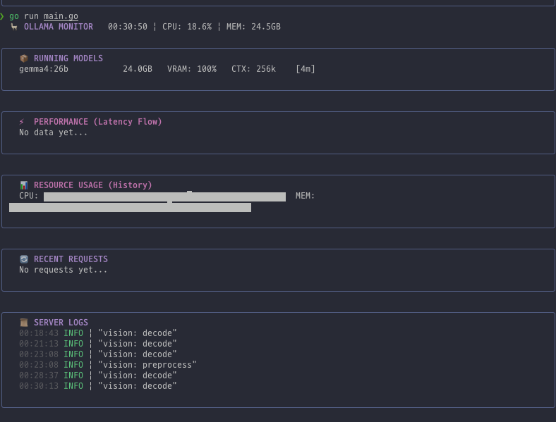

# 🦙 Ollama Monitoring CLI

A high-performance, real-time TUI (Terminal User Interface) dashboard for monitoring your local [Ollama](https://ollama.com/) server. Built with Go and Bubble Tea. Supports macOS, Linux, and Windows.



## ✨ Features

- **📦 Model Monitoring:** Real-time view of running models, including size, VRAM usage, context length, and TTL.
- **⚡ Performance Visualizer:** Live sparkline charts showing response time (latency) trends for API requests.
- **📊 Resource Usage:** Historical CPU and Memory usage graphs for the Ollama process.
- **📜 Live Log Streaming:** Real-time tailing of `server.log` and `app.log` with color-coded log levels (INFO, WARN, ERROR) and timestamps.
- **🔄 Request Tracker:** Detailed table of recent API requests with IDs, methods, paths, and statuses.
- **🖥️ Cross-Platform:** Native support for macOS, Linux, and Windows with automatic log path discovery.
- **📱 Responsive Layout:** Automatically adjusts UI components based on your terminal window size.

## 🚀 Quick Start

### Prerequisites

- [Go](https://go.dev/doc/install) 1.21 or higher.
- [Ollama](https://ollama.com/) installed and running.

### Installation

1. Clone the repository:
   ```bash
   git clone https://github.com/hunchulchoi/ollama-monitor-cli.git
   cd ollama-monitor-cli
   ```

2. Install dependencies:
   ```bash
   go mod tidy
   ```

3. Run the application:
   ```bash
   go run main.go
   ```

## ⚙️ Configuration

The application can be configured using command-line flags or a `.env` file.

### Priority
1. Command-line Flags (Highest)
2. `.env` File
3. System Defaults (Lowest)

### Command-line Flags
```bash
Usage of ollama-monitor:
  -url string
        Ollama API URL (e.g., http://localhost:11434)
  -key string
        Ollama API Key (if using a proxy/auth)
  -logdir string
        Custom Ollama Log Directory path
```

### Environment Variables (.env)
Copy the example file and modify it:
```bash
cp .env.example .env
```
Available variables:
- `OLLAMA_API_URL`: Ollama API endpoint.
- `OLLAMA_API_KEY`: API authentication key.
- `OLLAMA_LOG_DIR`: Custom path to the directory containing `server.log` and `app.log`.

## 🛠️ Tech Stack

- **Language:** Go (Golang)
- **TUI Framework:** [Bubble Tea](https://github.com/charmbracelet/bubbletea)
- **Styling:** [Lip Gloss](https://github.com/charmbracelet/lipgloss)
- **Process Monitoring:** [gopsutil](https://github.com/shirou/gopsutil)

## ⌨️ Keybindings

- `q` or `Ctrl+C`: Quit the application.

## 📝 License

This project is licensed under the MIT License - see the [LICENSE](LICENSE) file for details.

---
Built with ❤️ for the Ollama community.
