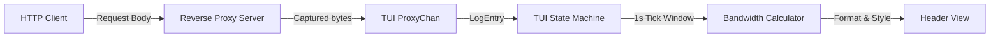

# Spec: Network Traffic & Bandwidth Monitoring

This document specifies the design for adding real-time network traffic volume (upload/download sizes) and bandwidth speed tracking to the Ollama Monitoring CLI by leveraging the integrated reverse proxy.

## 1. Requirements & Goals

*   **Real-time Traffic Tracking**: Capture request (upload) and response (download) data sizes passing through the proxy.
*   **Bandwidth Estimation**: Calculate real-time upload/download speeds (e.g., `KB/s`, `MB/s`) updated at 1-second intervals.
*   **Cumulative Statistics**: Monitor the total volume of network traffic uploaded and downloaded since the CLI's startup.
*   **Visual Integration**: Embed the networking statistics aesthetically into the primary header using rich HSL/Lip Gloss colors.
*   **Non-chat API Traffic Coverage**: Ensure standard API calls (like `/api/tags` or `/api/show`) also count towards overall traffic metrics, not just chat/generate APIs.

---

## 2. Technical Architecture

The data flows from the reverse proxy server, through the TUI input channel, into the state machine, and is rendered on the UI:



### 2.1. Model Enhancements (`LogEntry`)

We add `RequestSize` and `ResponseSize` fields to the `LogEntry` structure defined in `internal/ollama/logs.go`:

```go
type LogEntry struct {
	Time               time.Time
	Level              string
	Msg                string
	ResponseTime       time.Duration
	RequestID          string
	Method             string
	Path               string
	Status             string
	PromptEvalCount    int
	EvalCount          int
	PromptEvalDuration time.Duration
	EvalDuration       time.Duration
	TotalDuration      time.Duration
	LoadDuration       time.Duration
	
	// Network traffic stats in bytes
	RequestSize        int64
	ResponseSize       int64
}
```

### 2.2. Proxy Layer Tracking (`internal/ollama/proxy.go`)

To capture request and response sizes without breaking streams, the proxy hooks into two areas:

1.  **Request Body Size**: 
    In the proxy handler, before passing the request to the backend target, we read the Request Body to calculate upload size:
    ```go
    var reqSize int64
    if r.Body != nil {
        bodyBytes, _ := io.ReadAll(r.Body)
        reqSize = int64(len(bodyBytes))
        r.Body = io.NopCloser(bytes.NewBuffer(bodyBytes)) // Restore body for upstream
    }
    ```
2.  **Response Body Size**:
    In the `modifyResponse(resp *http.Response)` function, we measure the length of the read body buffer.
3.  **General Traffic Reporting**:
    Currently, the proxy immediately discards metrics if the path is not `/api/generate` or `/api/chat`. We will update `modifyResponse` so that it still measures sizes and transmits a `METRIC` level log for **any** API path.

### 2.3. TUI State Management (`internal/tui/model.go`)

We introduce variables to maintain the running traffic window and total volume statistics:

```go
type Model struct {
	// ... existing fields ...
	TotalUploadBytes      int64
	TotalDownloadBytes    int64
	UploadSpeed           float64 // bytes/sec
	DownloadSpeed         float64 // bytes/sec
	
	currentUploadWindow   int64 // temporary accumulator
	currentDownloadWindow int64 // temporary accumulator
}
```

Upon receiving a metric entry inside `handleLogEntry`:
```go
if entry.RequestSize > 0 {
    m.TotalUploadBytes += entry.RequestSize
    m.currentUploadWindow += entry.RequestSize
}
if entry.ResponseSize > 0 {
    m.TotalDownloadBytes += entry.ResponseSize
    m.currentDownloadWindow += entry.ResponseSize
}
```

Every 1-second `tickMsg` interval inside the Bubble Tea `Update` loop:
```go
case tickMsg:
    m.UploadSpeed = float64(m.currentUploadWindow)
    m.DownloadSpeed = float64(m.currentDownloadWindow)
    m.currentUploadWindow = 0
    m.currentDownloadWindow = 0
```

---

## 3. UI Design & Styles

### 3.1. Formatting Helper
A helper function `formatBytes(bytes float64)` is added to convert raw byte sizes into human-readable strings:

| Bytes Value | Formatted Output |
|---|---|
| `< 1024` | `X B` |
| `< 1,048,576` | `X.1 KB` |
| `< 1,073,741,824` | `X.1 MB` |
| `>= 1,073,741,824` | `X.2 GB` |

### 3.2. Lip Gloss Color Palette
We create specific styles in `internal/tui/styles.go` or `header_view.go`:
*   **Network Emoji (🛜)**: Sleek ash color.
*   **Upload Indicator (▲)**: Bright Tangerine/Peach HSL (e.g., `#FFA066` or Lip Gloss ANSI code for soft orange).
*   **Download Indicator (▼)**: Soft sky blue/Cyan HSL (e.g., `#70C0FF` or soft cyan).
*   **Total Volume Info**: Dim gray (e.g., `242` color code) to avoid distracting primary attention.

**Header Mockup**:
` 🦙 OLLAMA MONITOR  15:40:00 | CPU: 1.2% | MEM: 3.5GB | 🛜  ▲ 12.4 KB/s  ▼ 1.5 MB/s (Total: 4.8 MB)`

---

## 4. Verification Plan

### 4.1. TDD Unit Tests
We will add TDD tests inside `internal/ollama/proxy_test.go` and `internal/tui/model_test.go` to assert:
*   `TestProxyByteMeasurement`: Verify that simulated reverse proxy requests and responses accurately calculate input/output lengths.
*   `TestTUIBandwidthAccumulator`: Mocking `LogEntry` streams containing `RequestSize` and `ResponseSize` and checking if speed calculation logic correctly sets model speeds on Tick.
*   `TestFormatBytesHelper`: Unit testing edge cases for byte formatting.

### 4.2. Manual integration
Launch CLI locally with proxy mode on, issue sample prompts (or stream curls) via port `11435`, and visually verify the speeds fluctuate realistically and cumulative traffic ticks upwards correctly.
